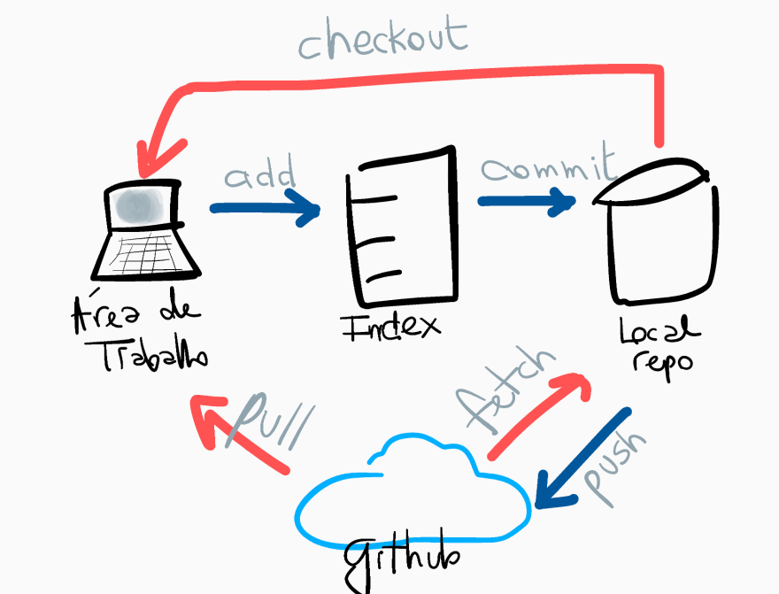
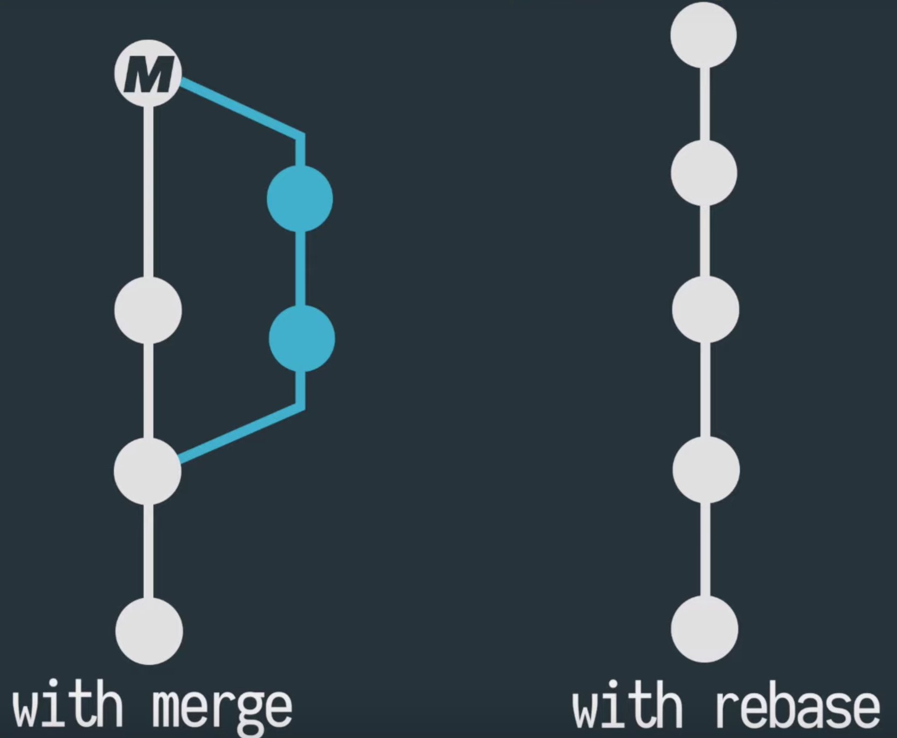

# <!--fit--> Como git pode salvar seu bacon!

---

<!-- backgroundColor: #123 -->
<!-- color: white -->
# AGENDA

- ### O que é GIT
- ### Conceitos
- ### Comandos iniciais
- ### Melhores práticas
- ### Rebase vs Merge vs Squash
- ### Stash and Amend é o seu melhor amigo

---
<!-- header: o que e git -->

# O QUE É GIT

- Sistema de computador criado pelo criador do linux em 2005
- Usado por desenvolvedores para poder salvar, rastrear, gerenciar codigo e facilitar o trabalho em equipe.
---
<!-- header: git conceitos -->

# CONCEITOS 

- ## Sistema distribuido de controle de versao
- ## Rastreamento / historico
- ## Snapshot (Commit)
- ## Reverta a qualquer momento

---
<!-- header: comandos iniciais -->
# COMANDOS INICIAIS

- ## git init
- ## git add `nome-do-arquivo` ou `.`
- ## git status
- ## git commit `-m "mensagem de commit"`

---
<!-- header: comandos inicias -->

- ## git push
- ## git pull
- ## git clone `nome do repositorio`

---
<!-- header: alem do basico -->
# MELHORES PRÁTICAS

- ### git branch `nome-da-ramificacao` / `-d nome-da-ramificacao`    
- ### git checkout `nome-da-ramificacao` / `-b nova-ramificacao`
- ### git diff
- ### git merge "feature"
- ### git rebase "master"

---

---
<!-- header: alem do basico -->

# <!--fit--> `git stash` and `amend` is your friend

- ## git stash / save "mensagem"
- ## git stash list (like git status)
- ## git stash clear / drop "stash-id"
- ## git stash pop / apply "stash-id"
- ## git commit --amend --no-edit

---
<!-- header: demo -->

---
<!-- header: thanks! -->
# Muito Obrigado!!!

Guilherme Epifanio

