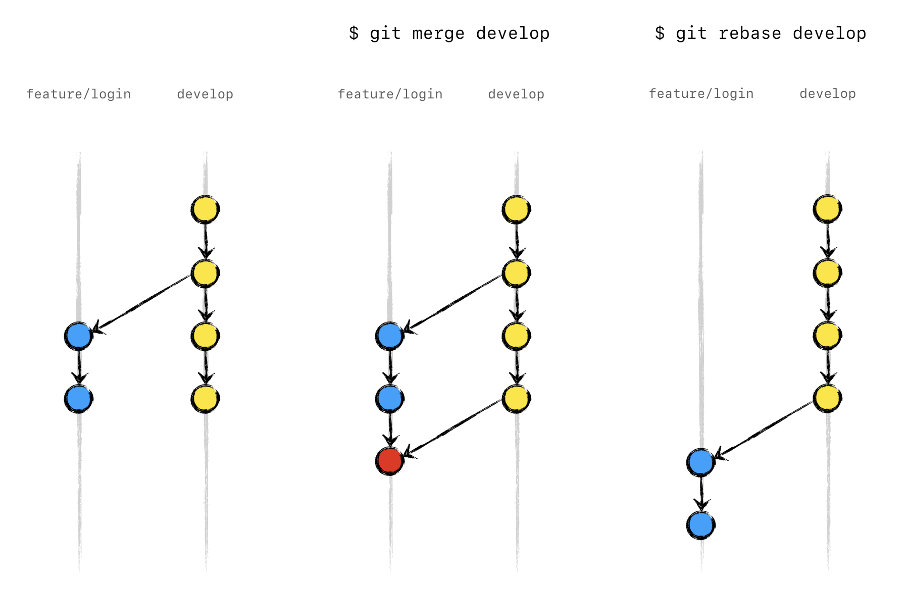

# <!--fit--> Como git pode salvar seu bacon!

---

<!-- backgroundColor: #123 -->
<!-- color: white -->
# AGENDA

- ### O que e GIT
- ### Conceitos
- ### Comandos basicos
- ### Além do básico
- ### Rebase vs Merge vs Squash
- ### Stash and Amend e o seu melhor amigo

---
<!-- header: o que e git -->

# O QUE E GIT

O Git é um sistema open-source de controle de versão utilizado pela grande maioria dos desenvolvedores atualmente. Com ele podemos criar todo histórico de alterações no código do nosso projeto e facilmente voltar para qualquer ponto para saber como o código estava naquela data.

Além disso, o Git nos ajuda muito a controlar o fluxo de novas funcionalidades entre vários desenvolvedores no mesmo projeto com ferramentas para análise e resolução de conflitos quando o mesmo arquivo é editado por mais de uma pessoa em funcionalidades diferentes.

---
<!-- header: git conceitos -->

# CONCEITOS 

* ## Distributed version control
* ## Code track / history
* ## Snapshot (Commit)
* ## Revert back any time

---
<!-- header: comandos basicos -->
# COMANDOS BASICOS

* ## git init
* ## git add `nome-do-arquivo` ou `.`
* ## git status
* ## git commit `-m "mensagem de commit"`

---
<!-- header: git basics -->

* ## git push
* ## git pull
* ## git clone `nome do repositorio`

---
<!-- header: alem do basico -->
# ALEM DO BASICO

* ## git checkout `nome-da-ramificacao` / `-b nova-ramificacao`
* ## git branch `nome-da-ramificacao` / `-d nome-da-ramificacao`    
* ## git diff
* ## git merge "feature"
* ## git rebase "feature"

---

# <!--fit--> Rebase x Merge/Squash

---

---
<!-- header: alem do basico -->

# <!--fit--> `git stash` and `amend` is your friend

* ## git stash / save "mensagem"
* ## git stash list (like git status)
* ## git stash clear / drop "stash-id"
* ## git stash pop / apply "stash-id"
* ## git commit --amend --no-edit

---
# <!--fit--> Muito Obrigado!!! 
# <!--fit--> Perguntas?
