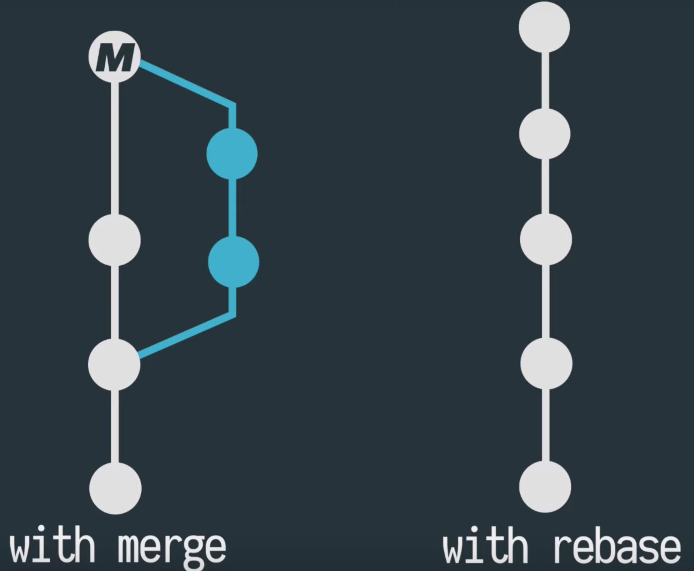

# <!--fit--> How to save your bacon

---

<!-- backgroundColor: #123 -->
<!-- color: white -->
# AGENDA

- ## Git basics
- ## Beyond the basics
- ## Rebase vs Merge vs Squash
- ## Stash and Amend is your friend

---
<!-- header: git conceps -->

# GIT CONCEPTS 

* ## Distributed version control
* ## Code track / history
* ## Snapshot (Commit)
* ## Revert back any time

---
<!-- header: git basics -->
# GIT BASICS

* ## git init
* ## git add `file-name` or `.`
* ## git status
* ## git commit `-m "message"`

---
<!-- header: git basics -->

* ## git push
* ## git pull
* ## git clone `repo-name`

---
<!-- header: beyond the basics -->
# BEYOND THE BASICS

* ## git checkout `branch-name` / `-b new-branch`
* ## git branch `branch-name` / `-d branch-name`    
* ## git diff
* ## git merge "feature"
* ## git rebase "feature"

---

# <!--fit--> Rebase x Merge/Squash

---

---
<!-- header: beyond the basics -->

# <!--fit--> `git stash` and `amend` is your friend

* ## git stash / save "message"
* ## git stash list (like git status)
* ## git stash clear / drop "stash-id"
* ## git stash pop / apply "stash-id"
* ## git commit --amend --no-edit

---

# `Thank you`
# `Questions?`

